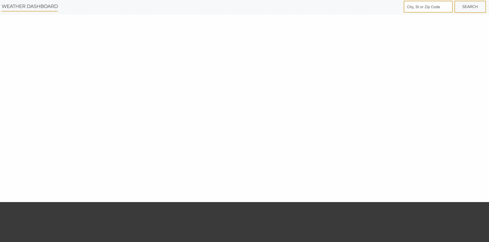

# Weather-Dashboard

This program is a daily planner for users to get weather. This will display weather for the desired city. The user has to put in their wanted city and click search. The API will show the latest temperature with the different type of atomerspheric pressure, humidity, wind speed and uv index. With this the user also get a graph of all the future and upcoming temperature for the day. They can also see the future weather for next five days. They can use it in any devices because the program is responsive. URL to the program : https://smundhada.github.io/Weather-Dashboard/

